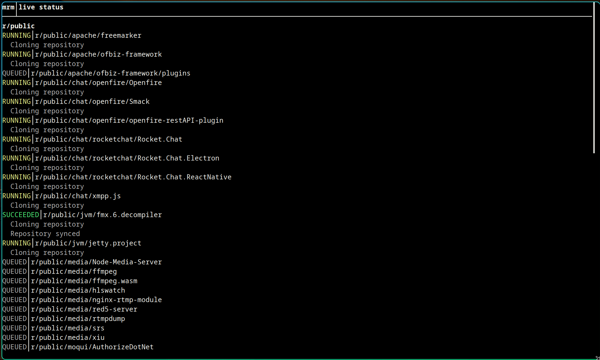

# mrm

**mrm (multi-repo-manager)** helps you manage many git repositories as one using
a YAML repository list.

Define your repositories once in a YAML file, then run a single command across
all of them to turn hours of repetitive maintenance into minutes.

Track one YAML file across multiple machines to ensure your repositories,
remotes, and branches stay in sync, so you can switch devices or collaborate
without setting up everything from scratch.

mrm is fast by default with parallel execution, and it ships with a beautiful
interactive FTXUI interface backed by a native C++ runtime.



Quick install:

```sh
curl -fsSL https://github.com/pythys/multi-repo-manager/raw/master/scripts/install.sh | sh -s -- --version 0.1.0
```

Example Command:

```sh
mrm update --config myrepos.yml --jobs 15
```

Documentation: https://pythys.github.io/multi-repo-manager/

- 📦 [Installation](docs/install.md)
- 🏁 [Quick Start](docs/guides/quickstart.md)
- 🚀 [Usage](docs/usage.md)
- 📚 [Guides](docs/guides/README.md)
- ⚙️ [Development](docs/development.md)
- 🧾 [YAML Schema](docs/yaml-schema.md)
- 🗺️ [Roadmap](docs/roadmap.md)

### Author

Taher Alkhateeb
https://github.com/pythys

## License

This project is licensed under the MIT License - see the [LICENSE](LICENSE) file for details.
